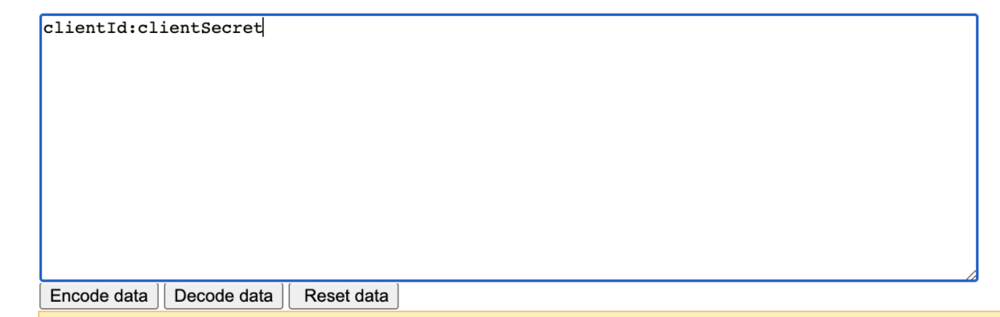
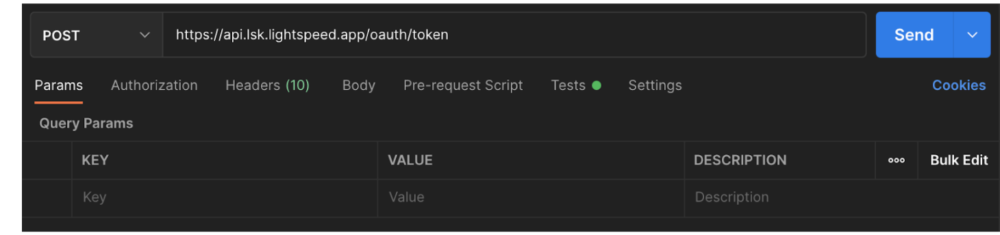
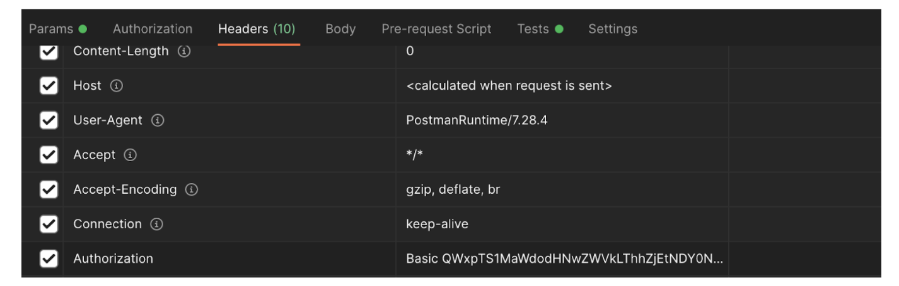
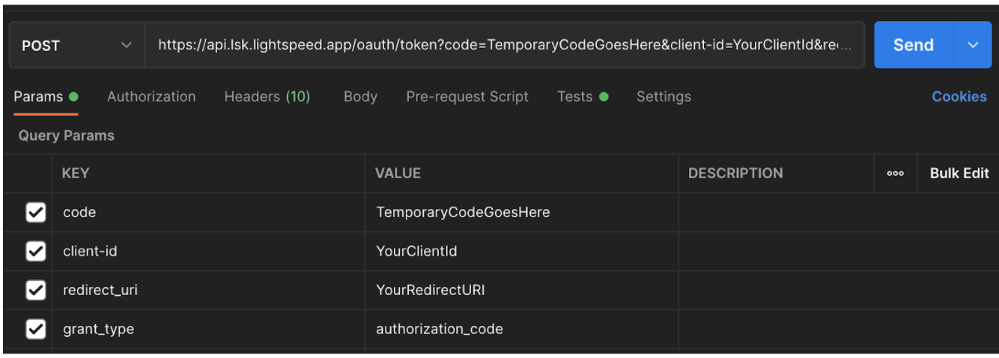

## Introduction

The K-Series API uses OAuth2 to authenticate API users. Below you will find step-by-step instructions for how to connect to the K-Series API.


### Before you begin:


* Make sure you have [Postman](https://www.postman.com/downloads/) installed.

* To request a new API client, please contact your Technical Partner Manager

* If you are connecting to an account on staging, your base URL should be:

  ```
https://api.trial.lsk.lightspeed.app/
```


* If you are connecting to an account on production, your base URL should be:

    ```
https://api.lsk.lightspeed.app/
```


## Steps


1. Provide the customer/user a URL to login and authorize the client. This URL should be opened in a browser window.

  Example:

  ```
https://api.lsk.lightspeed.app/oauth/authorize?client_id={{CLIENT_ID_HERE}}&response_type=code&redirect_uri={{REDIRECT_URI_HERE}}
```


  This sign in box should appear in the browser:

  

***

2.  The user will log in and accept the scope(s) requested for your client. We will then call your redirect URL with the authorization code in parameter, like this:


  ```
https://mycompany.com/redirection/ikentoo?code=VlWFo0
```


Copy the code to your clipboard.

***

3. Encode your clientId & clientSecret in base 64 in the following format: `clientId:clientSecret`

Here is a website you can use to encode:

[http://base64-encoder-online.waraxe.us/](http://base64-encoder-online.waraxe.us/)

Fill in your `clientId` and `clientSecret` with a colon in between them and click on `Encode data`.




***

4. In Postman, select the `POST` method and add one of the following URLs:

```
PRODUCTION: https://api.lsk.lightspeed.app/oauth/token
STAGING: https://api.trial.lsk.lightspeed.app/oauth/token
```



***

5. Go to `Headers` and add the following:

```
Authorization: Basic + {clientId:clientSecret encoded in base 64}
```

The authorization headers should look something like this:




***

6. Go to `Params` and add the following:

```
code: [the temporary authorization code from Step 2]

grant_type: authorization_code

client-id: [your client_id]

redirect_uri: [your redirect_uri]

```




The complete URL should look like this:


```
https://api.lsk.lightspeed.app/oauth/token?code={{TEMP_CODE}}&grant_type=authorization_code&client-id={{CLIENT_ID}}&redirect_uri={{REDIRECT_URI}}
```
***

7. Click `Send`.

You should now get the access token in response.
