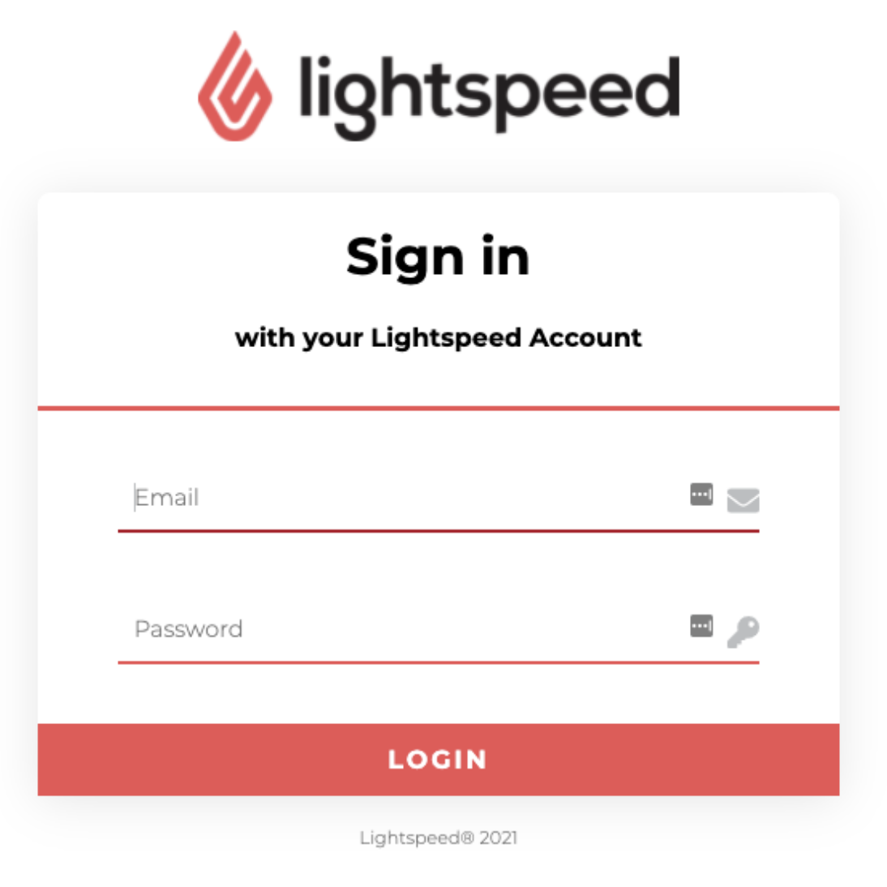
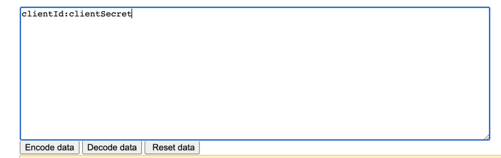
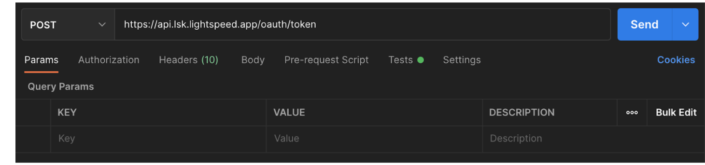
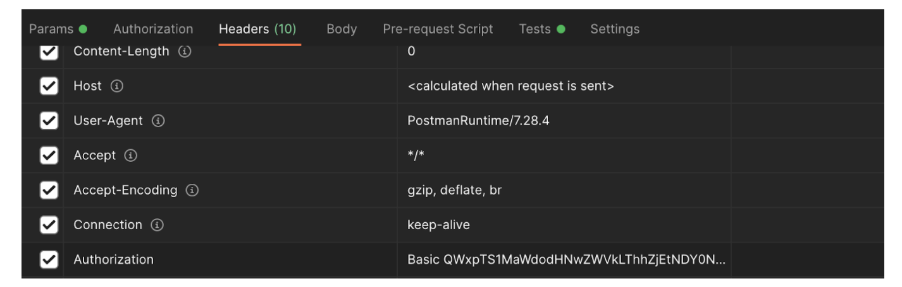
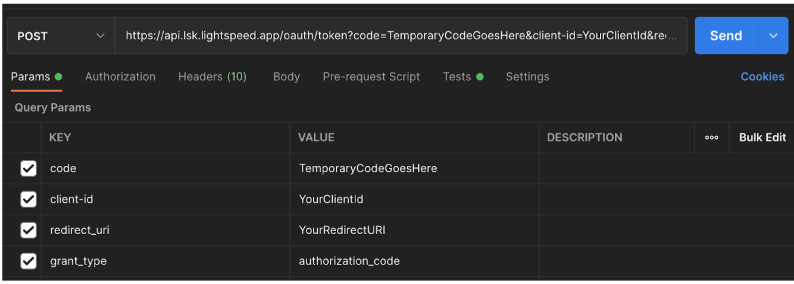

## Introduction

The K-Series API uses OAuth2 to authenticate API users. Below you will find step by step instructions for how to connect to the K-Series API.


### Before you begin:


* Make sure you have [Postman](https://www.postman.com/downloads/) installed.
* To request a new API client, you must fill out the following form: [https://forms.monday.com/forms/7f68bc61ebf1488faa1948ad3ec6b7fb](https://forms.monday.com/forms/7f68bc61ebf1488faa1948ad3ec6b7fb)
* To create your own client, please see:  [New Client and Demo Creation for K-Series](https://confluence.atlightspeed.net/x/zejNBw)
* If you are connecting to an account on staging, your base URL should be:

    ```
https://api.trial.lsk.lightspeed.app/
```


* If you are connecting to an account on production, your base URL should be:

    ```
https://api.lsk.lightspeed.app/
```


## Steps


1. Provide the customer/user a URL to login and authorize the client. This URL should be opened in a browser window.

Example:


```
https://api.lsk.lightspeed.app/oauth/authorize?client_id={{CLIENT_ID_HERE}}&response_type=code&redirect_uri={{REDIRECT_URI_HERE}}
```


This sign in box should appear in the browser:




2

The user will log in and accept the scope(s) requested for your client. Then your redirect URI will be called with the authorization code in parameter, like this:


```
https://mycompany.com/redirection/ikentoo?code=VlWFo0
```


Copy the code to your clipboard.

3

Encode your clientId & clientSecret in base 64 in the following format: clientId:clientSecret

Here is a website you can use to encode:

[http://base64-encoder-online.waraxe.us/](http://base64-encoder-online.waraxe.us/)

Fill in your clientId & clientSecret with a colon in between and click on "Encode data".





4

Go to Postman, select POST method and add the following url: [https://api.lsk.lightspeed.app/oauth/token](https://api.lsk.lightspeed.app/oauth/token) for production or [https://api.trial.lsk.lightspeed.app/oauth/token](https://api.trial.lsk.lightspeed.app/oauth/token) for staging.




5

Go to 'Headers' and add the following:

```

Authorization: Basic + {clientId:clientSecret encoded in base 64}
```

The authorization header should look like this:




6

Go to 'Params' and add the following
```
code: add the temporary authorization code from step 2

grant_type: authorization_code

client-id: add the client_id here

redirect_uri: add the redirect_uri here

```




The complete url should look like this:


```
https://api.lsk.lightspeed.app/oauth/token?code={{TEMP_CODE}}&grant_type=authorization_code&client-id={{CLIENT_ID}}&redirect_uri={{REDIRECT_URI}}
```


7

Click 'Send'.

You should now get the access token in response.
