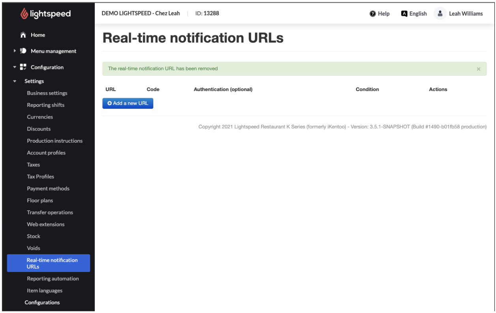
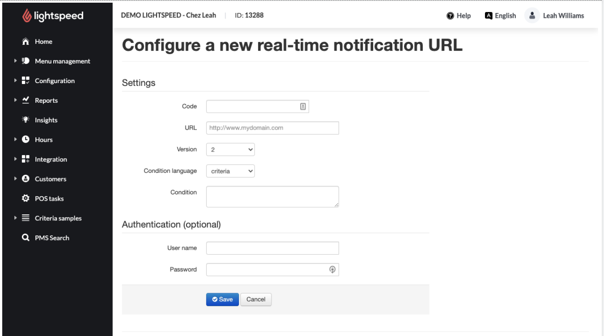
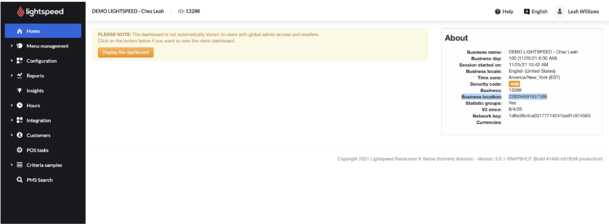

Setting Up Realtime Notifications (RTNs)
===============

### Introduction

Realtime Notifications allow partners to be notified of account activity at the URL of their choosing. They can opt to use authentication or not. They can also specify what conditions need to be met for the notifications to be sent.

### Steps

1. Login to the K-Series back office and navigate to Configuration>Settings> Realtime Notification URLs [https://https://manager.lsk.lightspeed.app/configuration/realtimeNotifications](https://https://manager.lsk.lightspeed.app/configuration/realtimeNotifications)

2. Click on "Add a new URL" and enter the Code (display name), The URL to be notified, and any conditions or authentication details necessary.

3. Reply to the partner confirming the RTN has been added, and provide the Business Location ID, found on the home screen

