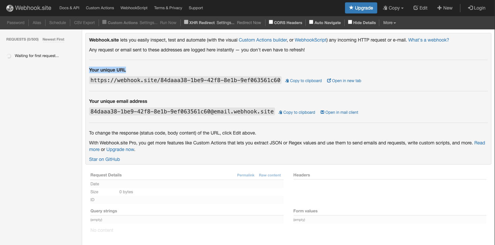
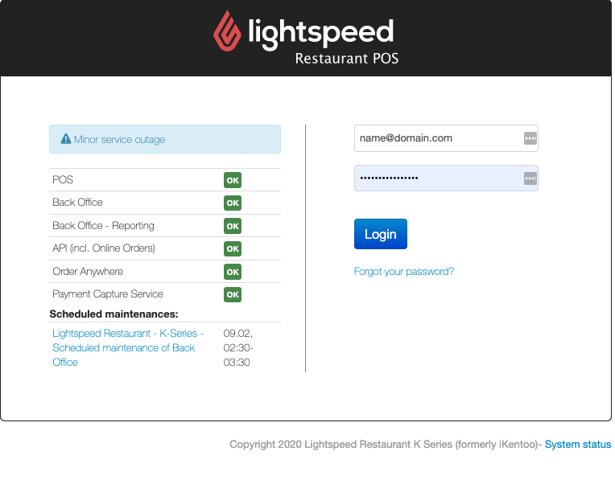
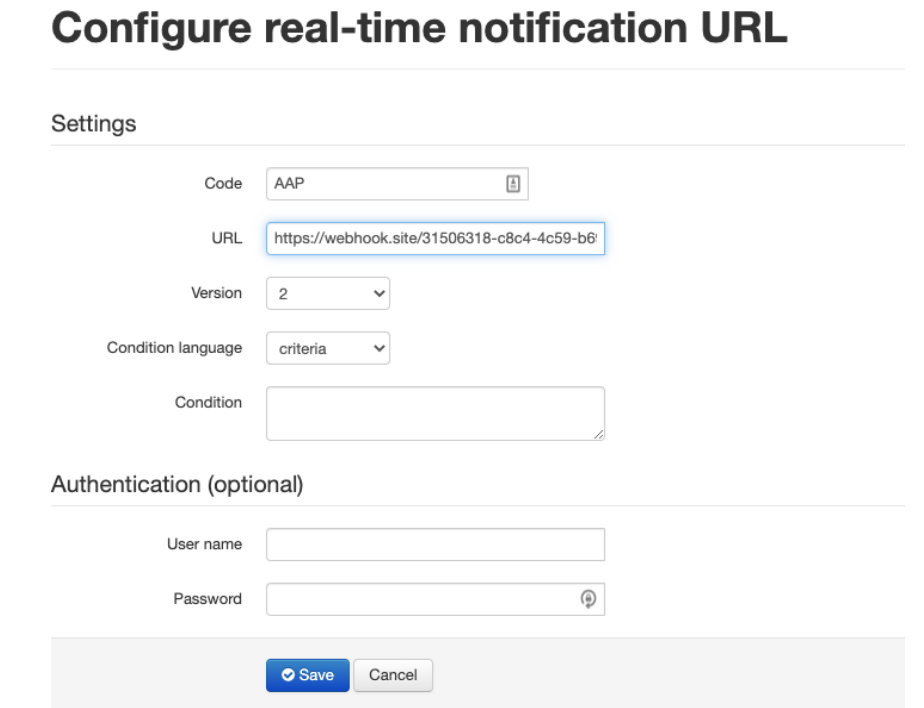

K-Series Real Time Notification - Sample Setup
===============

1. Go to the following site and copy the unique webhookURL.<br/><br/>
```
https://webhook.site/
```
<br/>



<br/>

2. Log in into your account with your username and password <br/><br/>



<br/>

3. Once logged in to your dashboard, navigate to:<br/><br/>

```
TRIAL: https://console-trial.ikentoo.com/configuration/realtimeNotifications
PROD: https://console.ikentoo.com/configuration/realtimeNotifications
```
<br/>



<br />

4. Fill in the following:<br/><br/>
```
URL: paste the unique webhookURL from step 1.
CODE : <Reference code for the RTN>
Authentication(Optional): Username and password to access the webhookURL
```

<br/>

Your endpoint is now set up to receive [Real Time Notifications](Technical&nbsp;Specifications/RTNs/RTNExamples.md).
