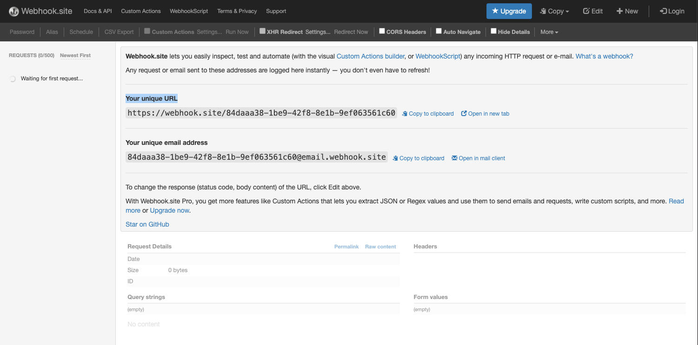
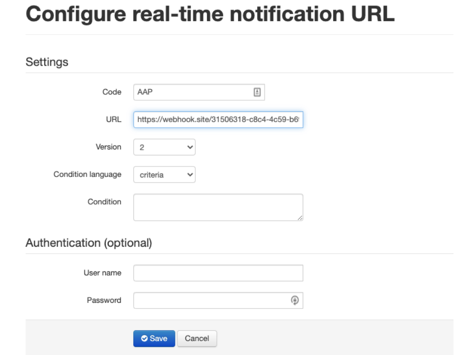

K-Series Webhook (RTN) Setup
===============

1. Go to the following site and copy the unique webhookURL.
```
https://webhook.site/
```

2. Log in into your account with your username and password


3. Once logged in to your dashboard, navigate to:

```
TRIAL: https://console-trial.ikentoo.com/configuration/realtimeNotifications
PROD: https://console.ikentoo.com/configuration/realtimeNotifications
```


4. Fill in the following:
```
URL: paste the unique webhookURL from step 1.
CODE : <Reference code for the RTN>
Authentication(Optional): Username and password to access the webhookURL
```
